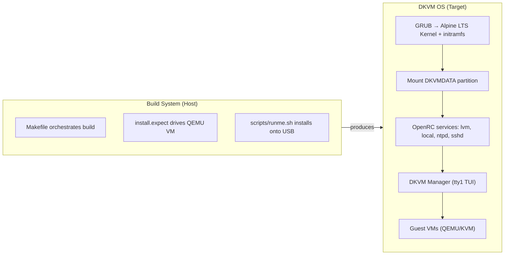

# DKVM Architecture Overview

This document explains the high-level architecture of DKVM — how the system is
designed, the rationale behind key decisions, and how the major components fit
together.

For detailed technical specifications (boot sequence commands, build pipeline
steps, acronym definitions, etc.), see
[Architecture Reference](architecture-reference.md).

---

## Design Philosophy

DKVM turns a desktop PC into a KVM hypervisor while keeping the host operating
system minimal and ephemeral.

### RAM-Based Operation

The host OS runs entirely from RAM after boot. The USB stick is read at boot
and written only during persistence saves. This design:

- **Eliminates disk wear** — no OS writes to the boot medium during normal
  operation.
- **Provides a clean slate** — a reboot restores the OS to its original state.
- **Maximizes resources for guests** — RAM is the primary resource for VMs.

### Two-Layer Persistence

DKVM separates system state from VM data using two distinct mechanisms:

1. **Alpine `lbu` overlay** — persists system configuration (network settings,
   installed packages, DKVM Manager binary) on the USB stick. Small, versioned,
   and managed by Alpine's standard tooling.
2. **DKVMDATA partition** — stores VM workload data (disk images, ISOs, TPM
   state) on a separate ext4 partition. Large, independent of the OS layer.

This separation means you can rebuild or replace the USB stick without losing
your VMs.

### Host as Hypervisor

Unlike traditional hypervisors that run on bare metal, DKVM runs on top of a
standard Alpine Linux installation. This gives you:

- A familiar Linux environment for debugging.
- Standard Alpine package management.
- Near-native VM performance via KVM/VFIO passthrough.

---

## Boot Flow Overview

When the DKVM host powers on, the following sequence occurs:

1. **Firmware loads GRUB** from the USB stick.
2. **GRUB boots Alpine** with IOMMU and VFIO parameters for device passthrough.
3. **Alpine starts in diskless mode** — the root filesystem lives in a tmpfs in
   RAM.
4. **The DKVMDATA partition is mounted** at `/media/dkvmdata` (if present).
5. **OpenRC services start** — LVM, NTP, SSH, and local scripts.
6. **DKVM Manager launches on tty1** — the TUI that manages VMs.
7. **User configures and runs VMs** via the TUI.

The entire OS lives in RAM. The USB stick is inactive after boot until a save
is triggered.

> For the exact kernel command-line parameters and a detailed step-by-step
> diagram, see [Boot Sequence](architecture-reference.md#boot-sequence) in the
> Architecture Reference.

---

## Key Design Decisions

### Why diskless Alpine?

Diskless mode is Alpine's standard approach for embedded and appliance use
cases. It provides:

- **Predictability** — every boot starts from the same known state.
- **Resilience** — corruption of the OS overlay is non-fatal; just re-image the
  USB.
- **Minimal footprint** — the OS uses only the RAM it needs.

### Why a separate DKVMDATA partition?

VM disk images and ISOs are too large for Alpine's `lbu` overlay (which lives
on the small USB stick). A dedicated ext4 partition keeps VM data independent
of the OS layer, making it:

- **Portable** — move the DKVMDATA drive to a different DKVM host.
- **Persistent** — survives OS reinstall or USB replacement.
- **Large** — sized for the workload, not limited by the USB stick.

### Why custom QEMU?

DKVM uses a custom QEMU build (hosted at `glemsom/dkvm-qemu`) with patches
specific to desktop KVM usage. This allows tuning QEMU for the passthrough
workload without waiting for upstream releases.

### Why a TUI?

The DKVM Manager TUI provides a guided interface for VM configuration without
requiring the user to edit XML or JSON files by hand. The TUI runs on tty1
with `respawn` in `/etc/inittab`, so it restarts automatically if it exits.

---

## How It All Fits Together

The build system produces a bootable USB image. That image boots into a
diskless Alpine OS which launches the DKVM Manager TUI. The user configures
VMs through the TUI, and those VMs run under QEMU/KVM with hardware
passthrough.

---

## Repositories

DKVM is split across three repositories. See
[Project Repositories](../README.md#project-repositories) in the README for
repository listings.
---

## Further Reading

- [Architecture Reference](architecture-reference.md) — detailed technical
  documentation (boot sequence, build pipeline, persistence, acronyms)
- [CONTEXT.md](../../CONTEXT.md) — project terminology and ubiquitous language
- [First-Boot Walkthrough](../user/first-boot.md) — practical setup guide
