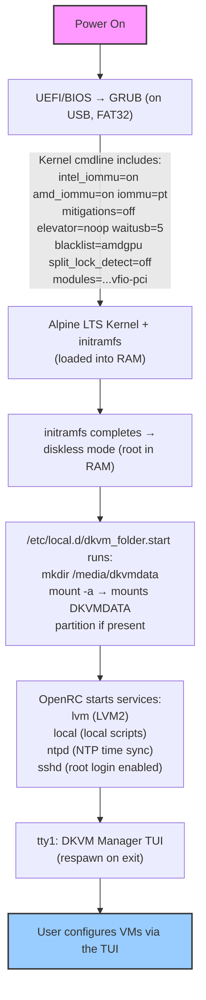
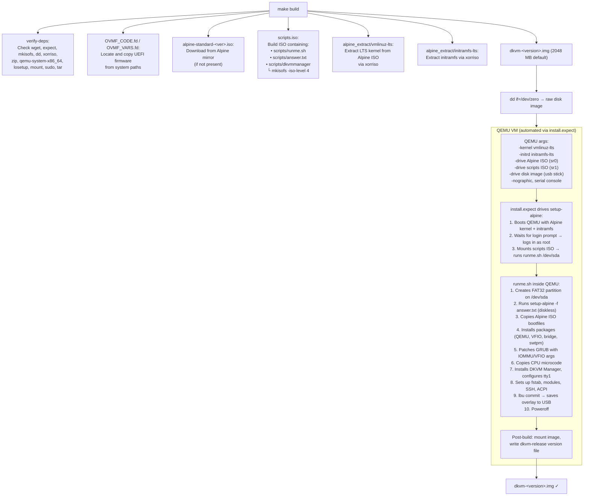
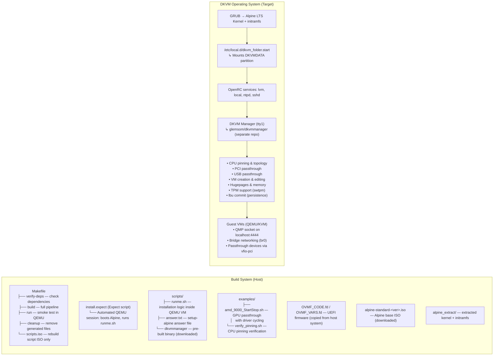

# DKVM Architecture

This document describes the end-to-end architecture of DKVM — how the operating
system is built, how it boots, how data persists, and how the components relate.

---

## Boot Sequence

DKVM follows a standard Alpine Linux diskless boot path with customizations for
virtualization and passthrough.



> **Terminology**: See [CONTEXT.md](../../CONTEXT.md) for the project's
> ubiquitous language — what "DKVM", "DKVMDATA", "Guest", "Host", and
> "DKVM Manager" mean in this codebase.

### Key points

- **Everything runs from RAM.** The USB is only read at boot and written during
  `lbu commit` or explicit saves. The OS roots are in a tmpfs.
- **GRUB is configured** by `scripts/runme.sh` during build to inject IOMMU,
  VFIO, and microcode parameters. CPU microcode (AMD + Intel) is loaded before
  the kernel.
- **DKVM Manager launches on tty1** via `/etc/inittab` with `respawn` flag so
  it restarts automatically if it exits.
- **DKVMDATA is optional at boot.** The `nofail` option in fstab means the
  system boots even if no DKVMDATA partition exists.

---

## Build Pipeline

DKVM uses a Makefile-based build system. The output is a bootable FAT32 disk
image (`dkvm-<version>.img`).

### Flow diagram



### Quick iteration (script-only changes)

For faster iteration when only `scripts/runme.sh` or `scripts/answer.txt`
change:

```bash
make scripts.iso && sudo expect install.expect \
  /usr/bin/qemu-system-x86_64 \
  OVMF_CODE.fd OVMF_VARS.fd \
  dkvm-<version>.img \
  alpine-standard-<ver>.iso \
  scripts.iso
```

This skips ISO download, kernel extraction, and OVMF discovery — reusing the
previously built artifacts.

### Inspecting a built image

```bash
sudo losetup --show -f -P dkvm-<version>.img
# → /dev/loop0
sudo mount /dev/loop0p1 /mnt
# Inspect contents: kernel, initramfs, scripts, dkvm-release
sudo umount /mnt
sudo losetup -d /dev/loop0
```

---

## Persistence Model

DKVM uses two persistence mechanisms that serve different purposes:

### 1. Alpine `lbu` overlay (on USB)

Alpine Linux in diskless mode keeps the root filesystem in a tmpfs. To persist
changes (configuration, installed packages, modified files), `lbu` stores an
overlay on the USB stick.

- **`lbu commit`** saves the current state to the USB.
- **`lbu include <path>`** marks a file/directory for inclusion in the overlay.
- DKVM Manager runs `lbu commit` automatically when configuration changes are
  saved.
- The overlay survives reboots because the USB is writable.

Files persisted via `lbu`:
- `/etc/inittab` (DKVM Manager on tty1)
- `/usr/bin/dkvmmanager` (the binary itself)
- System configuration changes made via the TUI

### 2. DKVMDATA data partition

VM workload data (disk images, ISOs, TPM state, VM configs) is too large for
the `lbu` overlay. It lives on a separate ext4 partition labeled `DKVMDATA`.

- **Auto-mounted** at `/media/dkvmdata` by `/etc/local.d/dkvm_folder.start`
  during boot.
- **Format**: ext4 with label `DKVMDATA`. Example:
  ```bash
  sudo mkfs.ext4 -L DKVMDATA /dev/sdXY
  ```
- **Contents**:
  - VM disk images (`.qcow2`, `.raw`)
  - ISO files for guest OS installation
  - TPM state directories (per-VM, managed by `swtpm`)
  - VM configuration files (managed by DKVM Manager)
- **`nofail`** in fstab ensures the system boots even if the partition is
  missing (first-boot scenario).

> **Important**: All VM and system configuration must be done through the
> DKVM Manager TUI. Manual editing of configuration files under
> `/media/dkvmdata` is not supported.

---

## Component Map



### External dependencies

| Component | Source | Notes |
|-----------|--------|-------|
| Alpine Linux | [alpinelinux.org](https://alpinelinux.org) | Base OS, diskless mode |
| QEMU | `glemsom/dkvm-qemu` (custom APK repo) | Custom build with DKVM patches |
| DKVM Manager | [glemsom/dkvmmanager](https://github.com/glemsom/dkvmmanager) | Go TUI, separate repo, version-pinned in Makefile |
| OVMF (UEFI) | Host system package | `ovmf` from Alpine community repo |
| swtpm | Alpine community repo | Software TPM for guests |

### Repositories

- **glemsom/dkvm** — This repo. Makefile, install scripts, examples,
  documentation. Produces the bootable USB image.
- **glemsom/dkvmmanager** — The Go TUI binary that runs on tty1. Pinned via
  `DKVM_MANAGER_VERSION` in the Makefile.
- **glemsom/dkvm-qemu** — Custom QEMU APK repository with DKVM-specific
  patches and configurations.

---

## Acronym Glossary

| Acronym | Expansion | Description |
|---------|-----------|-------------|
| ACPI | Advanced Configuration and Power Interface | Power management standard; DKVM uses ACPI events for graceful guest shutdown. |
| BIOS | Basic Input/Output System | Legacy firmware interface (DKVM uses UEFI/OVMF). |
| CPPC | Collaborative Processor Performance Control | Interface for managing CPU performance; used in pinning verification. |
| DHCP | Dynamic Host Configuration Protocol | Assigns IP addresses to network interfaces automatically. |
| DMA | Direct Memory Access | Allows devices to access memory without CPU involvement. |
| FAT32 | File Allocation Table (32-bit) | Filesystem used on the DKVM USB boot image. |
| GRUB | Grand Unified Bootloader | Bootloader that loads the Alpine kernel with IOMMU/VFIO parameters. |
| IOMMU | I/O Memory Management Unit | Hardware for device address translation; required for PCI passthrough. |
| KVM | Kernel-based Virtual Machine | Linux kernel module for hardware-accelerated virtualization. |
| LTS | Long Term Support | Alpine's stable kernel variant used by DKVM. |
| NAT | Network Address Translation | Masks guest IP behind host IP (user-mode networking). |
| NTP | Network Time Protocol | Synchronises system clock over the network. |
| OVMF | Open Virtual Machine Firmware | UEFI firmware for QEMU guests (TianoCore). |
| PCI | Peripheral Component Interconnect | Standard for connecting hardware devices. |
| QEMU | Quick EMUlator | The hypervisor that runs guest VMs. |
| QMP | QEMU Machine Protocol | JSON-based management interface for running QEMU instances. |
| SSH | Secure Shell | Encrypted remote access protocol. |
| STP | Spanning Tree Protocol | Network loop prevention (disabled on DKVM bridge). |
| TPM | Trusted Platform Module | Hardware security module; DKVM provides software TPM via swtpm. |
| TUI | Terminal User Interface | Text-based user interface (DKVM Manager on tty1). |
| UEFI | Unified Extensible Firmware Interface | Modern firmware interface; DKVM uses OVMF (UEFI) for guests. |
| USB | Universal Serial Bus | Standard for connecting peripherals and storage. |
| VBIOS | Video BIOS | Firmware for GPU initialisation; may be needed for passthrough. |
| vCPU | Virtual CPU | CPU core presented to a guest VM. |
| VFIO | Virtual Function I/O | Kernel framework for userspace device access (passthrough). |
| VGA | Video Graphics Array | Display hardware standard; used for GPU passthrough. |
| VM | Virtual Machine | A guest operating system instance running under QEMU/KVM. |

## ACPI Power Management

When the DKVM host power button is pressed, an ACPI event triggers:

```bash
echo '{ "execute": "qmp_capabilities" }' |
  echo '{ "execute": "system_powerdown" }' |
  timeout 5 nc localhost 4444
```

This sends a graceful shutdown request to the running guest VM via the QMP
socket. The host does not shut down until the guest responds.
